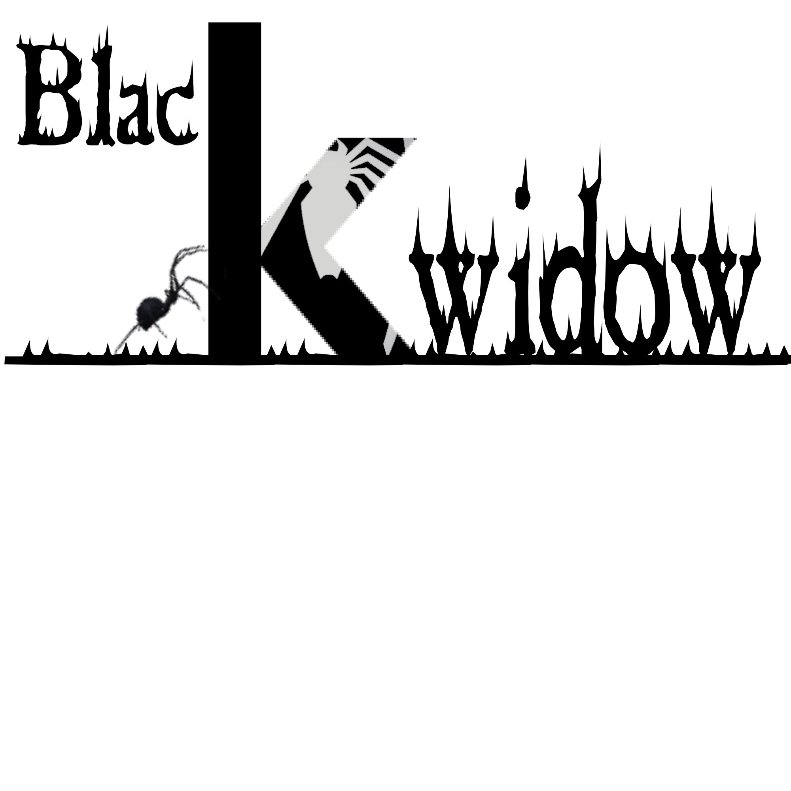

# B-dirf    @Black-widow-z

File directory bruteforcing

## Installation:

      git clone https://github.com/Black-widow-z/B-dirf.git && cd B-dirf && ./setup


## Run:
```$ b-dirf --help```

```$ b-dirf https://demo.com/```


